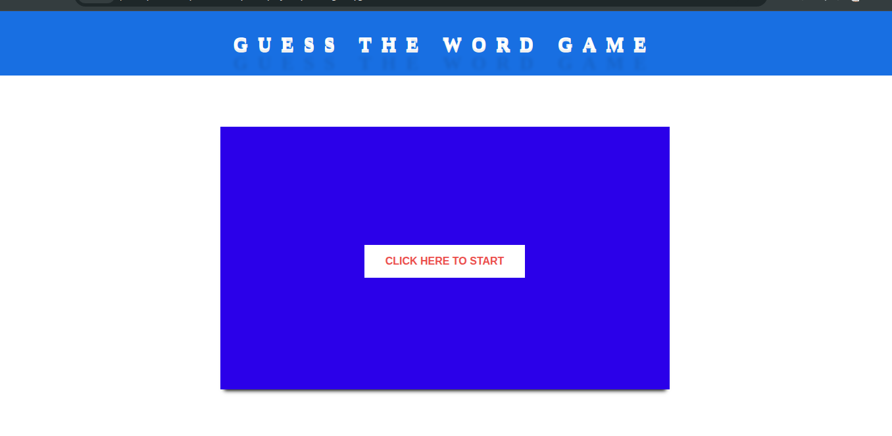

 **HTML CSS AND JS Class Projects**

 **Guess the Word Game ....**

 

 **LabTasks simple HTML CSS designs ...**

 *First
 

 *Second
 
  
  
 **Password Varification ...**
 
 
  
  
 **Sample Store ...**	
  
 
  
  
 **html-bootstrape-js-responsive ...**
  
 
  
  
 **Js class Tasks Assigned ...**
  
 *First
 
    
    
 *Second   
 
      
 *Third     
 
        
 *Fourth     
 
  
